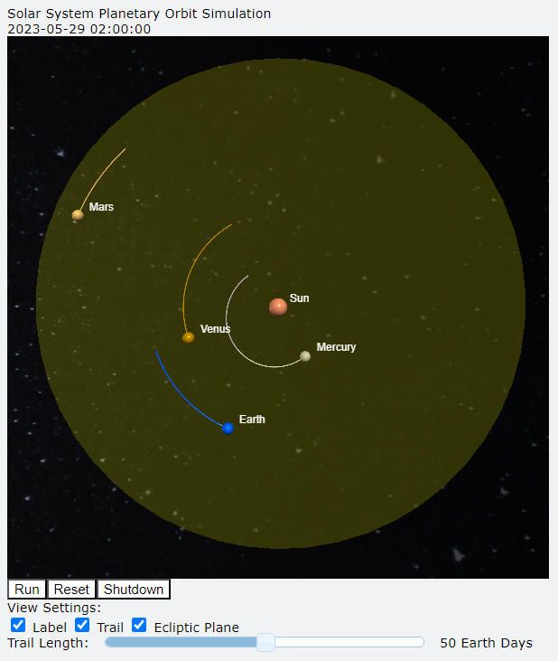

# Planetary_Simulation
## 專案介紹
本專案使用 Python 程式語言，利用 VPython 套件模擬太陽系行星的軌道運動。

## 專案技術
Python 3.9、VPython 7.6.4、Astropy 5.1。

## 資料夾說明
* data - 行星參數資料放置處
* fig - 圖片放置處

## 實作
### 行星參數
行星的質量與半徑參數使用自 NASA 。  
太陽: https://nssdc.gsfc.nasa.gov/planetary/factsheet/sunfact.html  
水星: https://nssdc.gsfc.nasa.gov/planetary/factsheet/mercuryfact.html  
金星: https://nssdc.gsfc.nasa.gov/planetary/factsheet/venusfact.html  
地球: https://nssdc.gsfc.nasa.gov/planetary/factsheet/earthfact.html  
火星: https://nssdc.gsfc.nasa.gov/planetary/factsheet/marsfact.html  
木星: https://nssdc.gsfc.nasa.gov/planetary/factsheet/jupiterfact.html  
土星: https://nssdc.gsfc.nasa.gov/planetary/factsheet/saturnfact.html  
天王星: https://nssdc.gsfc.nasa.gov/planetary/factsheet/uranusfact.html  
海王星: https://nssdc.gsfc.nasa.gov/planetary/factsheet/neptunefact.html  
註：由於類木行星軌道與類地行星軌道差異過大，因此本專案只模擬類地行星的軌道運動。

### Astropy
Astropy 套件是為了天文學所開發的套件包。
#### 單位換算
為了後續計算方便，使用 astropy.units 將單位統一為 km-kg-s。

#### 時間
使用 astropy.time 中的 Time 獲取模擬的初始時間。
``` python 
from astropy.time import Time
t_start = Time("2023-01-01")
```
#### 位置與速度
使用 astroquery.jplhorizons 中的 Horizons 獲取行星相對於太陽的狀態向量，以地球為例：
``` python
q = Horizons(id=399, location="@sun", epochs=t_start.tdb.jd).vectors()
```
從此狀態向量 `q` 即可獲取地球的初始位置與速度。
``` python
pos = vec(q["x"].to("km").value[0], q["y"].to("km").value[0], q["z"].to("km").value[0])
v = vec(q["vx"].to("km / s").value[0], q["vy"].to("km / s").value[0], q["vz"].to("km / s").value[0])
```

### 成果
依照上述獲取太陽及行星初始參數，使用 Vpython 套件即可模擬太陽系的行星軌道運動。

